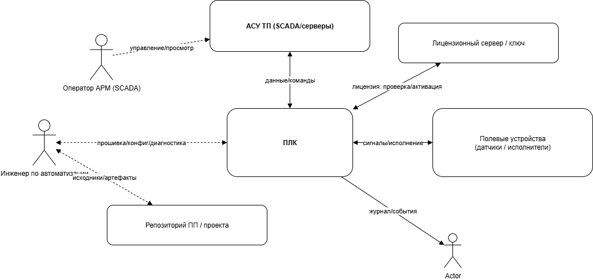
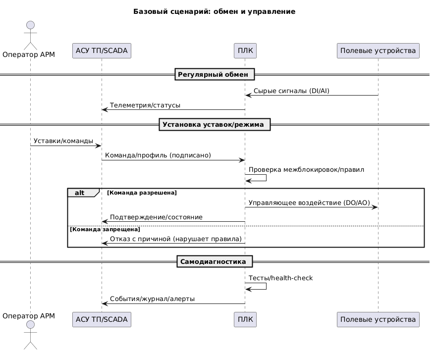
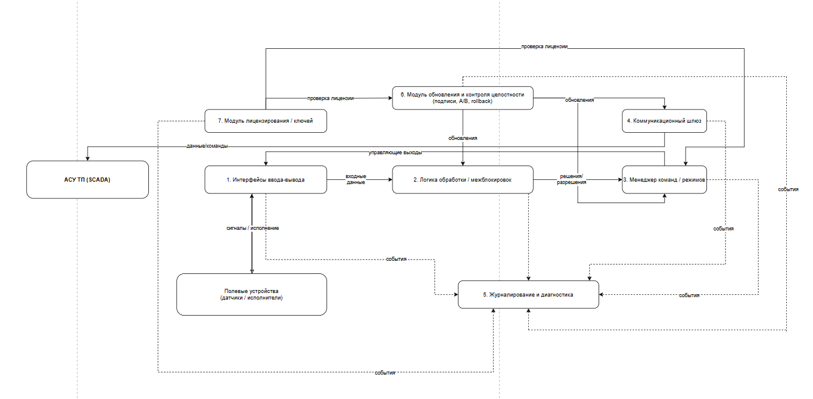
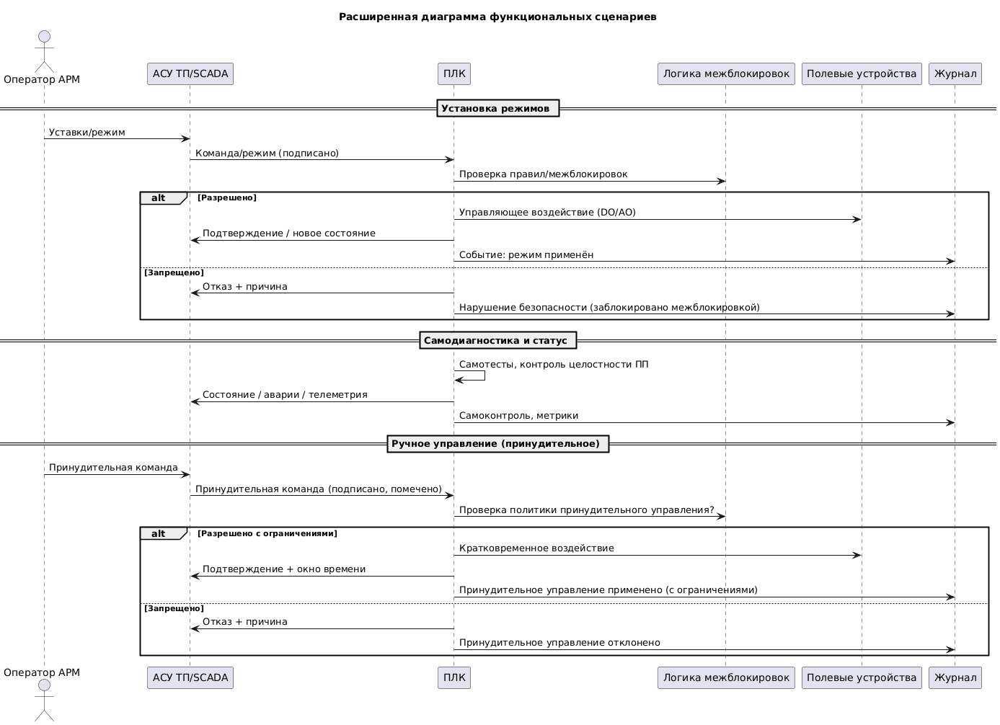
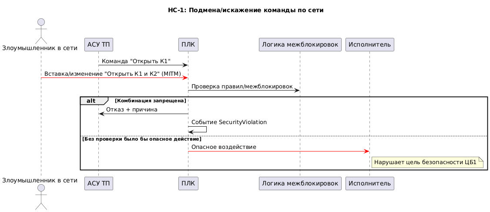
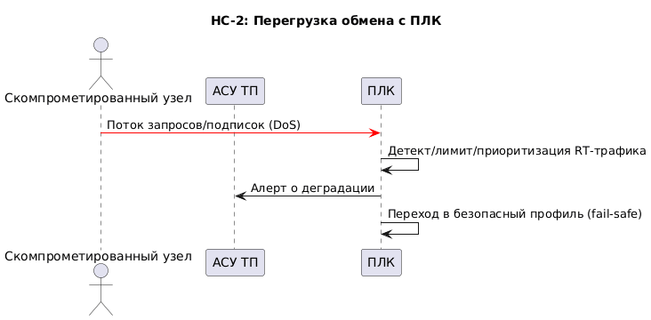
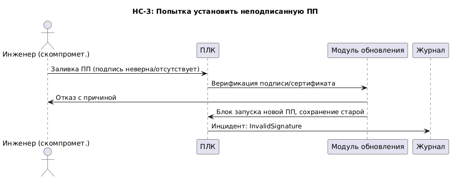
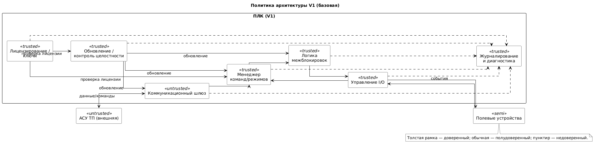
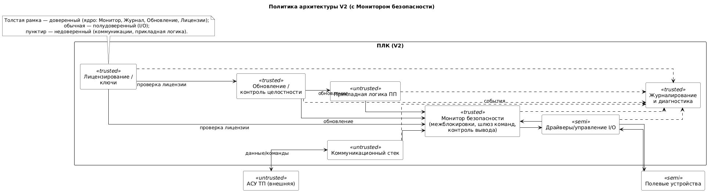

# Концепция безопасности "ПЛК в составе АСУ ТП"

## Краткое описание проектируемой системы

Программируемый логический контроллер (ПЛК) работает в составе автоматизированной системы управления технологическим процессом (АСУ ТП) и обеспечивает:
1. Приём «сырых» сигналов от полевых устройств и формирование управляющих воздействий.
2. Обмен технологическими данными и командами с верхним уровнем (SCADA/АРМ).
3. Самодиагностику и защищённое журналирование событий.
4. Безопасное обновление прикладной программы (ПП) и управление лицензиями/режимами.

## Ключевые ценности, ущербы, неприемлемые события

| Ценность                                  | Негативное событие                                                                 | Оценка ущерба | Комментарий                                                                 |
| :---------------------------------------- | :--------------------------------------------------------------------------------- | :------------ | :--------------------------------------------------------------------------- |
| Данные ПЛК (вход/обработка/выход/обмен)   | Искажение/подмена, потеря, не переданы в АСУ ТП                                   | Высокий       | Влияет на автоматику и решения оператора (SCADA)                             |
| Команды/режимы                            | Нет нужной команды; есть запрещённая/ложная                                       | Высокий       | Прямое воздействие на процесс                                               |
| Прикладная программа (ПП)                 | Неаутентичная ПП; несанкционированный доступ/утечка                               | Средний–Высокий | Риск закладок, компрометация интеллектуальной собственности                  |
| Лицензии/ключи                            | Подмена, нелегитимное использование                                               | Средний       | Влияние на доступные функции/режимы                                          |
| Журнал/аудит                              | Отсутствие, искажение, удаление, ложные события                                   | Средний       | Затрудняет расследование инцидентов                                          |
| Доступность ПЛК                           | DoS/зависание, «окирпичивание» при обновлении                                     | Высокий       | Простои, риск перехода в аварийные режимы                                    |

## Контекст

## Основные функциональные сценарии

## Высокоуровневая архитектура

### Описание подсистем

| Название                                   | Назначение                                                                                                        |
| :----------------------------------------- | :----------------------------------------------------------------------------------------------------------------- |
| 1. Интерфейсы ввода-вывода                 | Приём сигналов от датчиков (DI/AI) и выдача воздействий на исполнительные механизмы (DO/AO).                      |
| 2. Логика обработки/межблокировок          | Нормализация данных, правила безопасности (что разрешено/запрещено), тайм-ауты, безопасные состояния.             |
| 3. Менеджер команд/режимов                 | Приём уставок и команд сверху, валидация формата/прав, арбитраж источников, передача в межблокировки.            |
| 4. Коммуникационный шлюз                   | Протоколы обмена с АСУ ТП (например, Modbus/TCP, OPC UA), очереди, приоритизация, защитные лимиты.               |
| 5. Журналирование и диагностика            | Сбор технологических/админ/безопасностных событий, хеш-цепочка/подпись, экспорт «только-добавление».              |
| 6. Обновление и контроль целостности       | Проверка подписи/хэша ПП, secure-boot/измеренная загрузка, слоты A/B и auto-rollback, анти-replay.               |
| 7. Лицензирование/ключи                    | Проверка лицензий и опций, криптозащита, работа с сервером/аппаратным ключом.                                     |

## Расширенные диаграммы функциональных сценариев

*Иллюстрация взаимодействия подсистем в базовом сценарии/обновлении (см. также негативные сценарии ниже).*

## Цели и предположения безопасности

### Цели безопасности (ЦБ)

1. **ЦБ1 — Корректность управления.** Выполняются только разрешённые комбинации воздействий согласно межблокировкам, даже при ошибках/вредоносных командах сверху.  
2. **ЦБ2 — Целостность и аутентичность данных.** Защита от искажения/подмены на входе, в обработке и при обмене с АСУ ТП.  
3. **ЦБ3 — Журнал/Audit.** Полнота, неизменяемость и доступность событий для расследований.  
4. **ЦБ4 — Безопасное обновление/лицензирование.** Только аутентичная ПП/конфигурация; защита от «окирпичивания»; валидные лицензии.  
5. **ЦБ5 — Доступность и безопасная деградация.** Устойчивость к DoS/сбоям, переход в безопасное состояние.

### Предположения безопасности (ПБ)

1. **ПБ1 — Физическая безопасность.** Доступ к шкафу ПЛК и линиям контролируется.  
2. **ПБ2 — Безопасность смежных систем.** SCADA/сеть администрируются безопасно (вне скоупа ПЛК); ПЛК предоставляет им корректные данные.  
3. **ПБ3 — Надёжное питание/время.** Обеспечены резерв питания и синхронизация времени.

### Таблица соотнесения ценностей и целей безопасности

| Ценность                     | Негативное событие                                        | Цель(и) безопасности |
| :--------------------------- | :-------------------------------------------------------- | :------------------- |
| Данные ПЛК                   | Искажение/потеря/непередача                               | ЦБ2, ЦБ5            |
| Команды/режимы               | Ложные/запрещённые/нет нужной                             | ЦБ1, ЦБ2            |
| Прикладная программа         | Неаутентичная ПП, утечка                                  | ЦБ4, частично ЦБ3   |
| Лицензии/ключи               | Подмена/нелегитимное использование                        | ЦБ4                 |
| Журнал/аудит                 | Удаление/искажение/ложные события                         | ЦБ3                 |
| Доступность ПЛК              | DoS/окирпичивание                                         | ЦБ5, ЦБ4            |

## Негативные сценарии

### НС-1: Подмена/искажение команды по сети (нарушение ЦБ1, ЦБ2)

### НС-2: Перегрузка обмена (DoS) — нарушение ЦБ5

### НС-3: Попытка установить неподписанную ПП — нарушение ЦБ4

## Политика архитектуры

### Версия 1 (базовая)

Назначаем уровни доверия компонентам на основе рисков и целей безопасности.

| Домен безопасности                         | Уровень доверия                              | Оценка размера/сложности | Обоснование                                                                 |
| :----------------------------------------- | :------------------------------------------- | :------------------------ | :-------------------------------------------------------------------------- |
| Коммуникационный шлюз                      | Недоверенный                                 | MM                        | Пограничный, высокая поверхность атак                                       |
| Логика обработки/межблокировок             | Доверенный, повышающий целостность            | CL                        | Ядро безопасных решений (ЦБ1)                                               |
| Менеджер команд/режимов                    | Доверенный                                   | CL                        | Валидация команд/арбитраж                                                   |
| Управление I/O                             | Доверенный                                   | SS                        | Непосредственное воздействие на процесс                                     |
| Журналирование и диагностика               | Доверенный                                   | SM                        | Критично для расследований (ЦБ3)                                            |
| Обновление и лицензирование                | Доверенный                                   | SS                        | Реализует ЦБ4, риск «окирпичивания»                                         |

*Недостаток V1:* Большая доверенная база (TCB), сложнее верифицировать/тестировать.

### Версия 2 (с «Монитором безопасности»)

Вводим компактный Монитор безопасности (МБ) как ядро доверенной базы; остальные домены — недоверенные под контролем МБ.

| Домен безопасности                                       | Уровень доверия | Оценка | Обоснование                                                                 |
| :------------------------------------------------------- | :-------------- | :----- | :-------------------------------------------------------------------------- |
| **Монитор безопасности (МБ)**                            | Доверенный (SS) | SS     | Минимальный код, межблокировки, контроль команд/выходов (ЦБ1/ЦБ2/ЦБ5)       |
| Коммуникационный стек                                    | Недоверенный    | MM     | Все команды проходят через МБ; подписи/ACL                                  |
| Прикладная логика ПП                                     | Недоверенный    | CL     | Ошибки ПП не обходят МБ                                                      |
| Драйверы I/O                                             | Полудоверенный  | SM     | Выходы только через API МБ                                                   |
| Журналирование/диагностика                               | Доверенный      | SM     | Hash-chain, подписанный экспорт (ЦБ3)                                        |
| Обновление/лицензии                                      | Доверенный      | SS     | Secure-boot, A/B, rollback, ключи (ЦБ4)                                      |

*Преимущества V2:* минимизация TCB; внешние/сложные части не влияют напрямую на безопасность — все критические решения проходят через МБ.

## Прототип системы

*На данном этапе прототип не разрабатывается; при необходимости будет добавлена ссылка на репозиторий/демо.*
